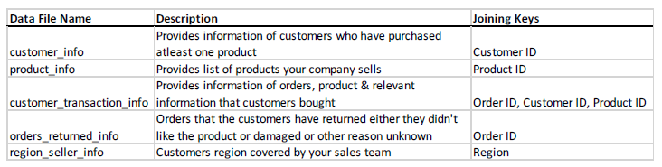

# predict-customer-product-preference
To build a predictive model to predict the probability that a given customer will buy a "printer-related product."

## Problem Statement:  
Your Marketing department would like to contextualize companies website to show viable products your customers might purchase based on past orders/transactions. To help with this effort, the Marketing department contacted you to build an ML model. Analyze the provided dataset and build a predictive model to predict the probability that a given customer will buy a "printer-related product." To achieve the following  
• Share your findings with the marketing team (non-technical or Business stakeholders)  
• Build a production-ready ML Model for deployment    
  
## Dataset:    
This is present under data/ directory and they are multiple JSON files.    
   
**Data Dictionary**    
  
  
"printer-related product" can be identified if a customer has ordered a product if the Product Name field contains the word “printer" and the product sub-category is 'Machines.'  

